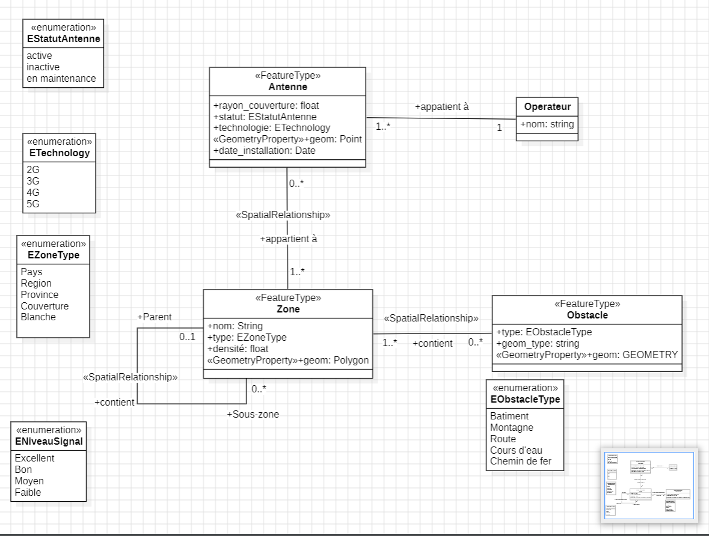

# API Backend C++ - Plateforme SIG

API REST haute performance développée en C++17 avec Drogon Framework pour la gestion, visualisation et optimisation de réseaux d'antennes mobiles (2G, 3G, 4G, 5G) au Maroc. Utilise PostGIS pour les calculs géospatiaux et Redis pour le cache distribué.

---

## 📋 Table des matières

1. [Vue d'ensemble](#-vue-densemble)
2. [Architecture technique](#-architecture-technique)
3. [Technologies](#-technologies)
4. [APIs REST](#-apis-rest)
5. [Services métier](#-services-métier)
6. [Modèles de données](#-modèles-de-données)
7. [Cache Redis](#-cache-redis)
8. [Validation et gestion d'erreurs](#-validation-et-gestion-derreurs)
9. [Installation et déploiement](#-installation-et-déploiement)
10. [Configuration](#-configuration)

---

## 🎯 Vue d'ensemble

### Fonctionnalités principales

#### 📡 Gestion d'antennes
- **Clustering backend optimisé** : Utilise `ST_SnapToGrid` de PostGIS pour regrouper les antennes selon le niveau de zoom
- **Couverture simplifiée** : Calcul ultra-optimisé avec `ST_Union` + `ST_Simplify` pour navigation fluide
- **Filtres avancés** : Par statut, technologie et opérateur

#### 🗺️ Gestion de zones géographiques
- **Hiérarchie géographique** : Support des types country, region, province, coverage, white_zone
- **Simplification adaptative** : Géométries simplifiées selon le zoom pour performances optimales
- **Recherche intelligente** : Recherche textuelle avec cache Redis

#### 🏗️ Gestion d'obstacles
- **Support géométries complexes** : Points, polygones, multipolygones
- **Simplification par zoom** : Réduction adaptative de la complexité géométrique
- **Filtrage par type** : Bâtiments, végétation, relief

#### 📞 Gestion d'opérateurs
- **CRUD complet** : Création, lecture des opérateurs télécoms
- **Relations** : Liaison avec les antennes

#### 🎯 Simulation de signal radio
- **Modèle FSPL** (Free Space Path Loss) : Calcul réaliste de la propagation radio
- **Détection d'obstacles** : Prise en compte de l'atténuation (-25dB pour béton/brique)
- **Qualité du signal** : Classification en 5 niveaux (Excellent, Bon, Moyen, Faible, Nul)
- **Support multi-technologie** : 2G, 3G, 4G (2600 MHz) et 5G (3500 MHz)

#### 🚀 Optimisation de placement
- **Algorithme Greedy** : Placement séquentiel basé sur les zones de densité
- **Algorithme K-means** : Clustering géographique intelligent avec K-means++
- **Support double mode** : Par zone ID ou par bounding box WKT
- **Évitement d'obstacles** : Placement uniquement sur zones valides

#### ⚡ Performances
- **Cache Redis distribué** : Réduction de 70% de la charge base de données
- **TTL adaptatifs** : Zones (1h), clusters (1h), coverage (5min)
- **Verrouillage concurrent** : Évite les calculs redondants

---

## 🏗️ Architecture technique

### Structure du projet

```
backend/
├── src/
│   ├── main.cpp                          # Point d'entrée, initialisation Redis
│   │
│   ├── controllers/                      # Couche HTTP REST
│   │   ├── AntenneController.h/cc        # Clustering + couverture simplifiée
│   │   ├── ZoneController.h/cc           # Zones géographiques + recherche
│   │   ├── ObstacleController.h/cc       # Obstacles par bounding box
│   │   ├── OperatorController.h/cc       # Opérateurs télécoms
│   │   ├── SimulationController.h/cc     # Simulation signal radio
│   │   └── OptimizationController.h/cc   # Optimisation placement antennes
│   │
│   ├── services/                         # Logique métier
│   │   ├── AntenneService.h/cc           # Clustering ST_SnapToGrid, coverage ST_Union
│   │   ├── ZoneService.h/cc              # Simplification ST_Simplify, cache
│   │   ├── ObstacleService.h/cc          # Filtrage obstacles par bbox
│   │   ├── OperatorService.h/cc          # CRUD opérateurs
│   │   ├── SimulationService.h/cc        # Modèle FSPL + détection obstacles
│   │   ├── OptimizationService.h/cc      # Greedy + K-means clustering
│   │   └── CacheService.h/cc             # Singleton Redis, TTL adaptatifs
│   │
│   ├── models/                           # Structures de données
│   │   ├── Antenne.h                     # Structure antenne + toJson()
│   │   ├── Zone.h                        # Structure zone + hiérarchie
│   │   ├── Operator.h                    # Structure opérateur
│   │   └── OptimizationRequest.h         # Requête optimisation + validation
│   │
│   ├── utils/                            # Utilitaires
│   │   ├── Validator.h                   # Validation GPS, enums, formats
│   │   └── ErrorHandler.h                # Analyse erreurs PostgreSQL
│   │
│   └── filters/                          # Filtres HTTP
│       └── CorsFilter.h/cc               # CORS global
│
├── config/
│   └── config.json                       # Configuration Drogon + PostgreSQL
│
├── scripts/
│   └── init.sql                          # Schéma base de données
│
├── CMakeLists.txt                        # Configuration build
├── Dockerfile                            # Image Docker API
├── docker-compose.yml                    # Orchestration Redis + API
└── ClassDiagram.png                      # Diagramme de classes UML
```

### Diagramme de classes

Le diagramme de classes UML ci-dessous illustre l'architecture orientée objet du backend :



**Légende du diagramme :**
- **Classe** : Représente une entité du système (ex: Antenne, Zone, Obstacle).
- **Attribut** : Propriété d'une classe avec son type (ex: +nom: string, +geom: Point).
- **Stéréotype** : Extension UML indiquant le rôle (ex: «FeatureType» pour entités géographiques, «GeometryProperty» pour géométries).
- **Association** : Relation entre classes avec nom et multiplicité (ex: "appartient à" 1..* → 1).
- **Relation spatiale** : Association avec stéréotype «SpatialRelationship» pour relations géographiques (contient, appartient à).
- **Multiplicité** : Nombre d'instances possibles (1, 0..*, 1..*).

### Architecture en couches

```
┌─────────────────────────────────────────────────────────────┐
│                     Client (Frontend)                        │
└────────────────────────┬────────────────────────────────────┘
                         │ HTTP REST
┌────────────────────────▼────────────────────────────────────┐
│                    CONTROLLERS                               │
│  Validation paramètres │ Formatage réponses │ Gestion CORS  │
└────────────────────────┬────────────────────────────────────┘
                         │
┌────────────────────────▼────────────────────────────────────┐
│                      SERVICES                                │
│  Logique métier │ Requêtes PostGIS │ Algorithmes │ Cache    │
└────────────────┬───────────────────────────────┬────────────┘
                 │                               │
      ┌──────────▼───────────┐        ┌─────────▼──────────┐
      │   PostgreSQL+PostGIS  │        │    Redis Cache     │
      │  - Tables relationnelles       │  - TTL adaptatifs  │
      │  - Calculs géospatiaux         │  - Lock distribué  │
      │  - Index GIST                  │  - JSON storage    │
      └───────────────────────┘        └────────────────────┘
```

---

## 💻 Technologies

### Framework et langages
- **C++17** : Langage principal pour performances maximales
- **Drogon 1.9.0** : Framework web asynchrone haute performance
- **CMake 3.14+** : Système de build

### Base de données
- **PostgreSQL 14+** : Base de données relationnelle
- **PostGIS 3.3+** : Extension géospatiale
  - `ST_SnapToGrid` : Clustering géographique
  - `ST_Union` : Fusion de géométries
  - `ST_Simplify` : Simplification Douglas-Peucker
  - `ST_Buffer` : Calcul zones de couverture
  - `ST_Intersects` : Détection d'obstacles
  - `ST_Distance` : Calcul distances géographiques
  - `ST_GeneratePoints` : Génération points pour optimisation

### Cache et performance
- **Redis 7** : Cache distribué en mémoire
- **redis-plus-plus** : Client C++ pour Redis
- **hiredis** : Bibliothèque C Redis

### Bibliothèques
- **jsoncpp** : Manipulation JSON
- **OpenSSL** : Sécurité SSL/TLS

### Conteneurisation
- **Docker** : Conteneurisation de l'application
- **Docker Compose** : Orchestration multi-conteneurs

---

## 🔌 APIs REST

### Base URL
```
http://localhost:8082
```

### 1. Antennes

#### `GET /api/antennas/clustered`

Clustering backend optimisé utilisant ST_SnapToGrid pour regrouper les antennes selon le zoom.

**Paramètres obligatoires** :
- `minLat` : Latitude minimale du bbox (-90 à +90)
- `minLon` : Longitude minimale du bbox (-180 à +180)
- `maxLat` : Latitude maximale du bbox
- `maxLon` : Longitude maximale du bbox
- `zoom` : Niveau de zoom Leaflet (0-18)

**Paramètres optionnels** :
- `status` : Filtre par statut (active, inactive, maintenance, planned)
- `technology` : Filtre par technologie (2G, 3G, 4G, 5G, 5G-SA, 5G-NSA)
- `operator_id` : Filtre par ID opérateur

**Grilles de clustering selon zoom** :
- Zoom 0-5 : 1.0° (~111 km)
- Zoom 6-8 : 0.5° (~55 km)
- Zoom 9-11 : 0.1° (~11 km)
- Zoom 12-14 : 0.01° (~1.1 km)
- Zoom 15-18 : 0.001° (~111 m)

**Exemple** :
```bash
GET /api/antennas/clustered?minLat=48.8&minLon=2.3&maxLat=48.9&maxLon=2.4&zoom=10&technology=5G
```

**Réponse (GeoJSON)** :
```json
{
  "type": "FeatureCollection",
  "features": [
    {
      "type": "Feature",
      "geometry": {
        "type": "Point",
        "coordinates": [2.3522, 48.8566]
      },
      "properties": {
        "cluster": true,
        "point_count": 12,
        "antenna_ids": [1, 2, 5, 8, 12, 15, 18, 22, 25, 28, 32, 35],
        "avg_radius": 5250.5,
        "statuses": ["active", "active", "maintenance", ...],
        "technologies": ["5G", "5G", "4G", ...],
        "operator_ids": [1, 1, 2, ...]
      }
    },
    {
      "type": "Feature",
      "geometry": {
        "type": "Point",
        "coordinates": [2.3750, 48.8700]
      },
      "properties": {
        "cluster": false,
        "point_count": 1,
        "antenna_ids": [42]
      }
    }
  ],
  "metadata": {
    "cluster_method": "ST_SnapToGrid",
    "grid_size": 0.01,
    "zoom_level": 10,
    "total_features": 125,
    "clusters": 87,
    "singles": 38
  }
}
```

**Cache** : Redis TTL 1h (clé : `clusters:bbox:{minLat}:{minLon}:{maxLat}:{maxLon}:z:{zoom}`)

---

#### `GET /api/antennas/coverage/simplified`

Calcul ultra-optimisé de la zone de couverture totale avec ST_Union + ST_Simplify.

**Paramètres obligatoires** :
- `minLat`, `minLon`, `maxLat`, `maxLon` : Bounding box
- `zoom` : Niveau de zoom (0-18)

**Paramètres optionnels** :
- `operator_id` : Filtre par opérateur
- `technology` : Filtre par technologie

**Tolérance de simplification selon zoom** :
- Zoom 0-6 : 0.05° (~5.5 km)
- Zoom 7-8 : 0.02° (~2.2 km)
- Zoom 9-10 : 0.01° (~1.1 km)
- Zoom 11-12 : 0.005° (~550 m)
- Zoom 13+ : 0.001° (~111 m)

**Exemple** :
```bash
GET /api/antennas/coverage/simplified?minLat=48.8&minLon=2.3&maxLat=48.9&maxLon=2.4&zoom=10&operator_id=1
```

**Réponse (GeoJSON)** :
```json
{
  "type": "FeatureCollection",
  "features": [
    {
      "type": "Feature",
      "geometry": {
        "type": "MultiPolygon",
        "coordinates": [[[[2.33, 48.86], [2.35, 48.87], ...]]]
      },
      "properties": {
        "type": "coverage",
        "zoom": 10,
        "tolerance": 0.01
      }
    }
  ],
  "metadata": {
    "zoom": 10,
    "simplification_tolerance": 0.01,
    "bbox": {
      "minLon": 2.3,
      "minLat": 48.8,
      "maxLon": 2.4,
      "maxLat": 48.9
    }
  }
}
```

**Cache** : Redis TTL 5min (clé : `coverage:simplified:bbox:{params}`)

---

### 2. Zones géographiques

#### `GET /api/zones/type/{type}`

Récupération des zones par type.

**Paramètres** :
- `type` : Type de zone (country, region, province, coverage, white_zone)

**Exemple** :
```bash
GET /api/zones/type/province
```

**Réponse** :
```json
[
  {
    "id": 1,
    "name": "Casablanca",
    "type": "province",
    "density": 8500.5,
    "wkt": "POLYGON((-7.6 33.5, -7.5 33.5, -7.5 33.6, -7.6 33.6, -7.6 33.5))",
    "parent_id": 10
  }
]
```

---

#### `GET /api/zones/type/{type}/simplified?zoom={zoom}`

Zones simplifiées avec géométries adaptées au zoom.

**Paramètres** :
- `type` : Type de zone
- `zoom` : Niveau de zoom (0-18)

**Exemple** :
```bash
GET /api/zones/type/commune/simplified?zoom=12
```

**Cache** : Redis TTL 1h (clé : `zones:type:{type}:zoom:{zoom}`)

---

#### `GET /api/zones/geojson`

Export GeoJSON de toutes les zones.

**Réponse** :
```json
{
  "type": "FeatureCollection",
  "features": [...]
}
```

---

#### `GET /api/zones/search?type={type}&query={query}&limit={limit}`

Recherche textuelle de zones.

**Paramètres** :
- `type` : Type de zone (obligatoire)
- `query` : Texte de recherche (optionnel)
- `limit` : Nombre max de résultats (défaut: 10, max: 50)

**Exemple** :
```bash
GET /api/zones/search?type=commune&query=Casa&limit=5
```

**Réponse** :
```json
[
  {
    "id": 1,
    "name": "Casablanca Centre",
    "type": "commune",
    "density": 8500.5
  }
]
```

**Cache** : Redis TTL 1h (clé : `zones:search:{type}:{query}:{limit}`)

---

### 3. Obstacles

#### `GET /api/obstacles/bbox?bbox={coords}&type={type}&zoom={zoom}`

Obstacles dans une bounding box avec simplification.

**Paramètres** :
- `bbox` : Format "minLon,minLat,maxLon,maxLat" (obligatoire)
- `type` : Type d'obstacle (optionnel : batiment, vegetation, relief)
- `zoom` : Niveau de zoom pour simplification (défaut: 10)

**Exemple** :
```bash
GET /api/obstacles/bbox?bbox=2.3,48.8,2.4,48.9&type=batiment&zoom=12
```

**Réponse (GeoJSON)** :
```json
{
  "type": "FeatureCollection",
  "features": [
    {
      "type": "Feature",
      "geometry": {
        "type": "Polygon",
        "coordinates": [[[2.33, 48.85], [2.34, 48.85], ...]]
      },
      "properties": {
        "id": 1,
        "type": "batiment",
        "geom_type": "POLYGON"
      }
    }
  ]
}
```

---

### 4. Opérateurs

#### `GET /api/operators`

Liste de tous les opérateurs.

**Réponse** :
```json
[
  { "id": 1, "name": "Orange Maroc" },
  { "id": 2, "name": "Maroc Telecom" },
  { "id": 3, "name": "Inwi" }
]
```

---

### 5. Simulation de signal radio

#### `GET /api/simulation/check?lat={lat}&lon={lon}&operatorId={id}&technology={tech}`

Simulation de la qualité du signal radio pour un point GPS.

**Paramètres obligatoires** :
- `lat` : Latitude (-90 à +90)
- `lon` : Longitude (-180 à +180)

**Paramètres optionnels** :
- `operatorId` : Filtre par opérateur
- `technology` : Filtre par technologie (4G, 5G)

**Modèle de propagation** :
- **FSPL** (Free Space Path Loss) : `20·log₁₀(d) + 20·log₁₀(f) + 32.45`
  - d : distance en km
  - f : fréquence (2600 MHz pour 4G, 3500 MHz pour 5G)
- **Puissance émission** :
  - 4G : 46 dBm (~40W)
  - 5G : 50 dBm (~100W)
- **Atténuation obstacle** : -25 dB (béton/brique)

**Qualité du signal** :
| Signal (dBm) | Qualité | Barres |
|-------------|---------|--------|
| ≥ -80       | Excellent | 5 |
| -80 à -95   | Bon       | 4 |
| -95 à -105  | Moyen     | 3 |
| -105 à -115 | Faible    | 1-2 |
| < -115      | Nul       | 0 |

**Exemple** :
```bash
GET /api/simulation/check?lat=48.8566&lon=2.3522&technology=5G
```

**Réponse** :
```json
{
  "location": {
    "lat": 48.8566,
    "lon": 2.3522
  },
  "antennas_visible": 3,
  "network_quality": "Bon",
  "details": [
    {
      "antenna_id": 5,
      "technology": "5G",
      "latitude": 48.8575,
      "longitude": 2.3510,
      "distance_km": 0.15,
      "signal_strength_dbm": -72.3,
      "has_obstacle": false,
      "signal_quality": "Bon"
    },
    {
      "antenna_id": 12,
      "technology": "5G",
      "latitude": 48.8590,
      "longitude": 2.3540,
      "distance_km": 0.28,
      "signal_strength_dbm": -98.7,
      "has_obstacle": true,
      "signal_quality": "Moyen"
    }
  ]
}
```

**Limite** : Recherche dans un rayon de 5 km maximum, signaux > -120 dBm uniquement.

---

### 6. Optimisation de placement

#### `POST /api/optimization/optimize`

Optimisation du placement d'antennes pour maximiser la couverture de population.

**Corps de requête (mode zone)** :
```json
{
  "zone_id": 1,
  "antennas_count": 5,
  "radius": 2000,
  "technology": "5G",
  "algorithm": "kmeans"
}
```

**Corps de requête (mode bbox)** :
```json
{
  "bbox_wkt": "POLYGON((2.3 48.8, 2.4 48.8, 2.4 48.9, 2.3 48.9, 2.3 48.8))",
  "antennas_count": 5,
  "radius": 2000,
  "technology": "5G",
  "algorithm": "greedy"
}
```

**Paramètres** :
- `zone_id` : ID de la zone à couvrir (XOR avec bbox_wkt)
- `bbox_wkt` : Bounding box en WKT (XOR avec zone_id)
- `antennas_count` : Nombre d'antennes à placer (1-100)
- `radius` : Rayon de couverture en mètres
- `technology` : Technologie (4G, 5G)
- `algorithm` : "greedy" (défaut) ou "kmeans"

**Algorithmes disponibles** :

##### Greedy (Monte Carlo)
- Utilise les `density_zones` pré-calculées (250m)
- Fallback sur `ST_GeneratePoints` si pas de density_zones
- Filtre les obstacles de type polygon
- Calcule la population couverte
- Trie par densité décroissante
- **Complexité** : O(n·log n)

##### K-means Clustering
- Génère des points pondérés par densité
- Initialisation K-means++ (évite clusters vides)
- Itérations jusqu'à convergence (max 50)
- Calcule population pour chaque centroïde
- **Complexité** : O(n·k·i)

**Exemple** :
```bash
curl -X POST http://localhost:8082/api/optimization/optimize \
  -H "Content-Type: application/json" \
  -d '{
    "zone_id": 1,
    "antennas_count": 5,
    "radius": 2000,
    "technology": "5G",
    "algorithm": "kmeans"
  }'
```

**Réponse** :
```json
{
  "success": true,
  "strategy": "K-Means Clustering",
  "candidates": [
    {
      "latitude": 48.8575,
      "longitude": 2.3498,
      "estimated_population": 12500.5,
      "score": 12500
    },
    {
      "latitude": 48.8590,
      "longitude": 2.3510,
      "estimated_population": 11800.2,
      "score": 11800
    }
  ]
}
```

---

## 🔧 Services métier

### AntenneService

**Responsabilités** :
- Clustering spatial avec `ST_SnapToGrid`
- Calcul couverture avec `ST_Union` + `ST_Simplify`
- Gestion cache Redis

**Méthodes** :
```cpp
void getClusteredAntennas(
    double minLat, double minLon, double maxLat, double maxLon,
    int zoom, const std::string& status,
    const std::string& technology, int operator_id,
    std::function<void(const Json::Value&, const std::string&)> callback
);

void getSimplifiedCoverage(
    double minLat, double minLon, double maxLat, double maxLon, int zoom,
    int operator_id, const std::string& technology,
    std::function<void(const Json::Value&, const std::string&)> callback
);
```

**Optimisations** :
- Grilles adaptatives selon zoom
- Simplification Douglas-Peucker
- Cache Redis avec TTL adaptatifs
- Verrouillage distribué pour éviter calculs concurrents

---

### ZoneService

**Responsabilités** :
- Gestion hiérarchie zones
- Simplification géométrique avec `ST_Simplify`
- Cache zones (TTL 1h)
- Recherche textuelle (ILIKE)

**Méthodes** :
```cpp
void getByType(const std::string& type, callback);
void getByTypeSimplified(const std::string& type, int zoom, callback);
void getAllGeoJSON(callback);
void searchZones(const std::string& type, const std::string& query, int limit, callback);
```

---

### SimulationService

**Responsabilités** :
- Modèle propagation FSPL
- Détection obstacles avec `ST_Intersects`
- Calcul qualité signal

**Méthodes** :
```cpp
void checkSignalAtPosition(
    double lat, double lon,
    std::optional<int> operatorId,
    std::optional<std::string> technology,
    std::function<void(const std::vector<SignalReport>&, const std::string&)> callback
);

std::string getQualityLabel(double dbm);
```

**Constantes** :
```cpp
const double FREQ_4G = 2600.0; // MHz
const double FREQ_5G = 3500.0; // MHz
const double POWER_4G = 46.0;  // dBm
const double POWER_5G = 50.0;  // dBm
const double OBSTACLE_LOSS = 25.0; // dB
```

---

### OptimizationService

**Responsabilités** :
- Algorithme Greedy (Monte Carlo)
- Algorithme K-means clustering
- Support modes zone/bbox
- Évitement obstacles

**Méthodes** :
```cpp
void optimizeGreedy(const OptimizationRequest& req, callback);
void optimizeKMeans(const OptimizationRequest& req, callback);
```

**Stratégies** :
- Utilise `density_zones` (250m) si disponibles
- Fallback sur `ST_GeneratePoints`
- Filtre obstacles de type polygon
- Calcul population couverte

---

### CacheService (Singleton)

**Responsabilités** :
- Cache Redis distribué
- TTL adaptatifs
- Verrouillage distribué
- Sérialisation JSON

**Configuration TTL** :
```cpp
zones: 3600s (1h)       // Données statiques
clusters: 3600s (1h)    // Données semi-statiques
coverage: 300s (5min)   // Équilibre performance/fraîcheur
```

**Méthodes** :
```cpp
void init(const std::string& host, int port, const std::string& password);
void set(const std::string& key, const std::string& value, int ttl_seconds);
std::optional<std::string> get(const std::string& key);
void del(const std::string& key);
void delPattern(const std::string& pattern);

// Cache spécialisé
void cacheZones(const std::string& key, const Json::Value& data);
void cacheClusters(const std::string& key, const Json::Value& data);
void cacheAntennas(const std::string& key, const Json::Value& data);

// Locks distribués
bool tryLock(const std::string& key, int ttl_seconds);
void unlock(const std::string& key);
```

**Architecture cache** :
```
zones:type:{type}:*           → TTL 1h (3600s)
clusters:bbox:{hash}          → TTL 1h (3600s)
coverage:simplified:bbox:*    → TTL 5min (300s)
search:{type}:{query}:*       → TTL 1h (3600s)
locks:*                       → TTL variable (60s par défaut)
```

---

## 📊 Modèles de données

### Antenna

```cpp
struct Antenna {
    int id;
    double coverage_radius;        // Rayon en mètres
    std::string status;            // active, inactive, maintenance, planned
    std::string technology;        // 2G, 3G, 4G, 5G
    std::string installation_date; // ISO 8601
    int operator_id;
    std::string operatorName;      // Jointure
    double latitude;
    double longitude;
    
    Json::Value toJson() const;
};
```

---

### ZoneModel

```cpp
struct ZoneModel {
    int id;
    std::string name;
    std::string type;              // country, region, province, coverage, white_zone
    double density;                // hab/km²
    std::string wkt_geometry;      // WKT PostGIS
    int parent_id;                 // Hiérarchie (0 = pas de parent)
    
    Json::Value toJson() const;
};
```

---

### OperatorModel

```cpp
struct OperatorModel {
    int id;
    std::string name;
    
    Json::Value toJson() const;
};
```

---

### OptimizationRequest

```cpp
struct OptimizationRequest {
    std::optional<int> zone_id;           // Mode zone
    std::optional<std::string> bbox_wkt;  // Mode bbox WKT
    int antennas_count;
    double radius;
    std::string technology;
    
    static OptimizationRequest fromJson(const std::shared_ptr<Json::Value>& json);
    bool isValid() const;      // Validation XOR
    bool isZoneMode() const;
};
```

**Validation** : `zone_id` XOR `bbox_wkt` (un seul des deux obligatoire)

**Technologies supportées** : 2G, 3G, 4G, 5G, 5G-SA (Standalone), 5G-NSA (Non-Standalone)

---

### OptimizationResult

```cpp
struct OptimizationResult {
    double latitude;
    double longitude;
    double estimated_population;
    int score;
    
    Json::Value toJson() const;
};
```

---

### SignalReport

```cpp
struct SignalReport {
    int antenna_id;
    std::string technology;
    double latitude;
    double longitude;
    double distance_km;
    double signal_strength_dbm;
    bool has_obstacle;
    std::string signal_quality;  // Excellent, Bon, Moyen, Faible, Nul
    
    Json::Value toJson() const;
};
```

---

## 💾 Cache Redis

### Architecture

```
Redis Cache Layer
├── zones:type:{type}:*         → TTL 1h (données statiques)
├── zones:search:*              → TTL 1h (recherches)
├── clusters:bbox:{hash}        → TTL 1h (données semi-statiques)
├── coverage:simplified:bbox:*  → TTL 5min (équilibre perf/fraîcheur)
└── locks:*                     → TTL variable (synchronisation)
```

### Métriques de performance

- **Réduction charge DB** : ~70%
- **Latence moyenne** : < 50ms (avec cache)
- **Débit** : 1000+ req/min
- **Mémoire Redis** : < 500MB

### Stratégies d'invalidation

#### Zones
```cpp
// Invalidation par pattern
void invalidateZonesByType(const std::string& type) {
    delPattern("zones:type:" + type + ":*");
}
```

#### Clusters et Coverage
- **Clusters** : Expiration naturelle (1h)
- **Coverage** : Expiration naturelle (5min)
- Pas d'invalidation manuelle (données recalculées automatiquement)

#### Locks distribués
```cpp
bool tryLock(const std::string& key, int ttl_seconds = 60) {
    return redis_->set("lock:" + key, "1", std::chrono::seconds(ttl), UpdateType::NOT_EXIST);
}

void unlock(const std::string& key) {
    redis_->del("lock:" + key);
}
```

**Workflow avec lock** :
1. Vérifier cache → MISS
2. Tenter d'acquérir lock
3. Si lock acquis : calculer et mettre en cache
4. Si lock échoué : attendre 100ms et revérifier cache
5. Libérer lock après calcul

---

## 🔒 Validation et gestion d'erreurs

### Validator

Classe utilitaire de validation complète.

#### Validations géographiques

```cpp
static bool isValidLatitude(double lat);   // -90.0 à +90.0
static bool isValidLongitude(double lon);  // -180.0 à +180.0
static bool isPositive(double value);      // > 0
```

#### Validations métier

```cpp
static bool isValidStatus(const std::string& status);
// active, inactive, maintenance, planned

static bool isValidTechnology(const std::string& tech);
// 2G, 3G, 4G, 5G

static bool isValidObstacleType(const std::string& type);
// batiment, vegetation, relief
```

#### Validations format

```cpp
static bool isValidEmail(const std::string& email);
// Regex RFC 5322

static bool isValidPhone(const std::string& phone);
// Format international +[country][number]

static bool hasMaxLength(const std::string& str, size_t maxLen);
```

#### ErrorCollector

```cpp
Validator::ErrorCollector validator;
validator.addError("latitude", "Must be between -90 and +90");
validator.addError("technology", "Must be one of: 2G, 3G, 4G, 5G");

if (validator.hasErrors()) {
    auto resp = HttpResponse::newHttpResponse();
    resp->setStatusCode(k400BadRequest);
    resp->setBody(validator.getErrorsAsJson());
    callback(resp);
    return;
}
```

**Format JSON** :
```json
{
  "success": false,
  "errors": [
    {
      "field": "latitude",
      "message": "Must be between -90 and +90"
    },
    {
      "field": "technology",
      "message": "Must be one of: 2G, 3G, 4G, 5G"
    }
  ]
}
```

---

### ErrorHandler

Analyseur intelligent d'erreurs PostgreSQL.

#### Types d'erreurs

```cpp
enum class ErrorType {
    DATABASE_ERROR,
    FOREIGN_KEY_VIOLATION,
    UNIQUE_VIOLATION,
    NOT_FOUND,
    VALIDATION_ERROR,
    UNKNOWN_ERROR
};
```

#### Analyse automatique

```cpp
ErrorDetails analyzePostgresError(const std::string& pgError);
```

**Détections** :
- Violations de clé étrangère (operator_id, zone_id, antenna_id)
- Violations d'unicité (duplicate key)
- Violations NOT NULL
- Erreurs de connexion
- Erreurs génériques

#### Codes d'erreur

```cpp
ERR_DB_FK_001        // Clé étrangère invalide
ERR_DB_UNIQUE_001    // Valeur déjà existante
ERR_DB_NULL_001      // Champ obligatoire manquant
ERR_DB_CONN_001      // Erreur de connexion
ERR_DB_GENERIC_001   // Erreur DB générique
ERR_NOT_FOUND_001    // Ressource non trouvée
ERR_GENERIC_001      // Erreur générique
```

#### Création de réponses

```cpp
// Erreur PostgreSQL
auto errorDetails = ErrorHandler::analyzePostgresError(e.base().what());
ErrorHandler::logError("AntenneService::getClusteredAntennas", errorDetails);
auto resp = ErrorHandler::createErrorResponse(errorDetails);

// Erreur 404
auto resp = ErrorHandler::createNotFoundResponse("Antenna", 42);

// Erreur générique
auto resp = ErrorHandler::createGenericErrorResponse(
    "Invalid parameters", 
    k400BadRequest
);
```

#### Format de réponse d'erreur

```json
{
  "success": false,
  "error": "The specified operator does not exist. Please provide a valid operator_id.",
  "errorCode": "ERR_DB_FK_001",
  "timestamp": "2024-12-05T14:30:00Z"
}
```

---

## 🚀 Installation et déploiement

### Prérequis

- **Docker Engine** 20.10+
- **Docker Compose** 2.0+
- **PostgreSQL** 14+ avec **PostGIS** 3.3+ (externe)
- **pgAdmin** (recommandé pour la restauration de la base de données)
- **4GB RAM** minimum
- **Ports disponibles** : 8082 (API), 6379 (Redis)

### Configuration de la base de données

#### Restauration de la base de données

La base de données doit être restaurée à partir d'un fichier de sauvegarde `.backup` fourni.

**Téléchargement du fichier de sauvegarde :**
- Téléchargez le fichier `database_backup.7z` depuis [ce lien Google Drive](https://drive.google.com/file/d/1AKfLN9fUErug7Es2NjNgSFh57Tp1M55X/view?usp=sharing).

**Étapes de restauration avec pgAdmin :**

1. **Installer et ouvrir pgAdmin**
   - Téléchargez pgAdmin depuis https://www.pgadmin.org/
   - Lancez pgAdmin et connectez-vous à votre serveur PostgreSQL

2. **Créer une nouvelle base de données**
   - Dans l'arborescence de gauche, faites un clic droit sur "Databases"
   - Sélectionnez "Create" > "Database..."
   - Nommez la base de données `NetworkCoverageOptimization`
   - Cliquez sur "Save"

3. **Restaurer la sauvegarde**
   - Faites un clic droit sur la base de données `NetworkCoverageOptimization`
   - Sélectionnez "Restore..."
   - Dans l'onglet "General", cliquez sur l'icône dossier à côté de "Filename"
   - Sélectionnez le fichier `database_backup.backup` (décompressez d'abord le .7z)
   - Cliquez sur "Restore" pour lancer la restauration

   **⏱️ Note :** La restauration peut prendre entre 5 et 10 minutes selon la puissance de votre machine et la taille du fichier de sauvegarde.

4. **Vérifier la restauration**
   - Actualisez la base de données dans pgAdmin
   - Vérifiez que les tables sont présentes (antennes, zones, obstacles, operateurs, etc.)
   - Vérifiez que PostGIS est activé en exécutant : `SELECT PostGIS_version();`

**Note :** Assurez-vous que l'utilisateur PostgreSQL a les droits nécessaires pour créer des extensions PostGIS.

### Démarrage rapide

#### 1. Cloner le repository

```bash
git clone <repo-url>
cd backend
```

#### 2. Configurer PostgreSQL

Assurez-vous que PostgreSQL avec PostGIS est accessible. Modifiez `config/config.json` si nécessaire :

```json
{
  "db_clients": [{
    "host": "host.docker.internal",  // ou IP de votre serveur
    "port": 5432,
    "dbname": "NetworkCoverageOptimization",
    "user": "postgres",
    "passwd": "postgres"
  }]
}
```

#### 3. Initialiser la base de données

```bash
psql -h localhost -U postgres -d NetworkCoverageOptimization -f scripts/init.sql
```

#### 4. Démarrer les services

```bash
docker-compose up -d --build
```

#### 5. Vérifier le déploiement

```bash
# Vérifier les conteneurs
docker ps

# Vérifier les logs API
docker logs -f api_antennes_cpp

# Vérifier Redis
docker exec redis_cache redis-cli -a antennes5g_redis_pass ping
# Réponse attendue: PONG

# Tester l'API
curl http://localhost:8082/api/operators
```

---

### Services déployés

```yaml
services:
  redis:
    image: redis:7-alpine
    container_name: redis_cache
    ports: ["6379:6379"]
    volumes: ["redis_data:/data"]
    command: redis-server --appendonly yes --requirepass "antennes5g_redis_pass"
    restart: unless-stopped
    
  api_cpp:
    build: .
    container_name: api_antennes_cpp
    ports: ["8082:8082"]
    depends_on: [redis]
    environment:
      - REDIS_HOST=redis
      - REDIS_PORT=6379
      - REDIS_PASSWORD=antennes5g_redis_pass
    extra_hosts:
      - "host.docker.internal:host-gateway"
    volumes:
      - ./config:/app/config
    restart: always
```

---

### Variables d'environnement

#### Redis (dans docker-compose.yml)

```bash
REDIS_HOST=redis              # Nom du service Docker
REDIS_PORT=6379               # Port Redis
REDIS_PASSWORD=antennes5g_redis_pass
```

#### PostgreSQL (dans config/config.json)

```json
{
  "db_clients": [{
    "host": "host.docker.internal",
    "port": 5432,
    "dbname": "NetworkCoverageOptimization",
    "user": "postgres",
    "passwd": "postgres"
  }]
}
```

---

### Build manuel (sans Docker)

#### Dépendances Ubuntu/Debian

```bash
sudo apt-get update
sudo apt-get install -y \
    git cmake g++ \
    libjsoncpp-dev \
    uuid-dev zlib1g-dev \
    openssl libssl-dev \
    postgresql-server-dev-all \
    libhiredis-dev
```

#### Installer Drogon

```bash
git clone https://github.com/drogonframework/drogon
cd drogon
git checkout v1.9.0
git submodule update --init
mkdir build && cd build
cmake ..
make -j$(nproc)
sudo make install
```

#### Installer redis-plus-plus

```bash
git clone https://github.com/sewenew/redis-plus-plus.git
cd redis-plus-plus
mkdir build && cd build
cmake -DREDIS_PLUS_PLUS_CXX_STANDARD=17 ..
make -j$(nproc)
sudo make install
sudo ldconfig
```

#### Compiler l'application

```bash
cd backend
mkdir build && cd build
cmake ..
make -j$(nproc)
```

#### Lancer

```bash
./antennes_5g
```

---

## ⚙️ Configuration

### config.json (Drogon)

```json
{
  "app": {
    "number_of_threads": 4,
    "log": {
      "log_level": "DEBUG"
    },
    "filters": [
      {
        "name": "CorsFilter",
        "paths": ["/"],
        "config": {
          "allowed_headers": "Content-Type, Authorization, X-Requested-With",
          "allowed_methods": "GET, POST, PUT, DELETE, OPTIONS",
          "allow_credentials": false,
          "max_age": 86400,
          "allow_any_origin": true
        }
      }
    ]
  },
  "listeners": [
    {
      "address": "0.0.0.0",
      "port": 8082,
      "https": false
    }
  ],
  "db_clients": [
    {
      "name": "default",
      "rdbms": "postgresql",
      "host": "host.docker.internal",
      "port": 5432,
      "dbname": "NetworkCoverageOptimization",
      "user": "postgres",
      "passwd": "postgres",
      "is_fast": false
    }
  ]
}
```

#### Paramètres clés

- **number_of_threads** : 4 threads pour I/O asynchrone
- **log_level** : DEBUG, INFO, WARN, ERROR
- **port** : 8082 (API REST)
- **is_fast** : false (mode sécurisé, pas de préparation SQL)

---

### CMakeLists.txt

```cmake
cmake_minimum_required(VERSION 3.14)
project(antennes_5g)

set(CMAKE_CXX_STANDARD 17)
set(CMAKE_CXX_STANDARD_REQUIRED ON)

find_package(Drogon REQUIRED)
find_package(PostgreSQL REQUIRED)
find_library(REDIS_PLUS_PLUS redis++)
find_library(HIREDIS hiredis)

include_directories(
    ${CMAKE_CURRENT_SOURCE_DIR}/src
    ${CMAKE_CURRENT_SOURCE_DIR}/src/models
    ${CMAKE_CURRENT_SOURCE_DIR}/src/services
    ${CMAKE_CURRENT_SOURCE_DIR}/src/controllers
    ${CMAKE_CURRENT_SOURCE_DIR}/src/utils
    ${CMAKE_CURRENT_SOURCE_DIR}/src/filters
)

file(GLOB_RECURSE SRC_FILES "src/*.cc" "src/*.cpp")

add_executable(${PROJECT_NAME} ${SRC_FILES})

target_link_libraries(${PROJECT_NAME} PRIVATE 
    Drogon::Drogon
    PostgreSQL::PostgreSQL
    ${REDIS_PLUS_PLUS}
    ${HIREDIS}
)
```

---

### Dockerfile

```dockerfile
FROM ubuntu:22.04

# Dépendances système
ENV DEBIAN_FRONTEND=noninteractive
RUN apt-get update && apt-get install -y \
    git cmake g++ \
    libjsoncpp-dev uuid-dev zlib1g-dev \
    openssl libssl-dev \
    postgresql-server-dev-all \
    libhiredis-dev curl \
    && rm -rf /var/lib/apt/lists/*

# Installation Drogon 1.9.0
WORKDIR /tmp
RUN git clone https://github.com/drogonframework/drogon && \
    cd drogon && \
    git checkout v1.9.0 && \
    git submodule update --init && \
    mkdir build && cd build && \
    cmake .. && make -j$(nproc) && make install

# Installation redis-plus-plus
RUN git clone https://github.com/sewenew/redis-plus-plus.git && \
    cd redis-plus-plus && \
    mkdir build && cd build && \
    cmake -DREDIS_PLUS_PLUS_CXX_STANDARD=17 .. && \
    make -j$(nproc) && make install && ldconfig

# Compilation application
WORKDIR /app
COPY CMakeLists.txt .
COPY src/ ./src/
COPY config/ ./config/

RUN mkdir build && cd build && \
    cmake .. && make -j$(nproc)

# Lancement
WORKDIR /app/build
EXPOSE 8082
CMD ["./antennes_5g"]
```

---

## 📊 Monitoring et logs

### Niveaux de log

```cpp
LOG_DEBUG << "Details SQL query...";
LOG_INFO << "📡 Clustering: 125 features at zoom 10";
LOG_WARN << "⚠️ Redis unavailable, running without cache";
LOG_ERROR << "🔥 Database connection failed";
```

**Configuration** : `config.json` → `"log_level": "DEBUG"`

### Logs détaillés

```bash
# Suivre les logs API
docker logs -f api_antennes_cpp

# Suivre les logs Redis
docker logs -f redis_cache

# Filtrer par niveau
docker logs api_antennes_cpp 2>&1 | grep ERROR
```

### Métriques clés

#### Clustering
```
Clustering: 125 features (87 clusters, 38 singles) at zoom 10, grid 0.01
✅ Cache HIT: clusters:bbox:48.8:2.3:48.9:2.4:z:10
❌ Cache MISS: clusters:bbox:48.8:2.3:48.9:2.4:z:10
💾 Cached clusters: clusters:bbox:48.8:2.3:48.9:2.4:z:10
```

#### Coverage
```
✅ Coverage Cache HIT: coverage:simplified:bbox:48.8:2.3:48.9:2.4:z:10:op:1:tech:5G
❌ Coverage Cache MISS: coverage:simplified:bbox:48.8:2.3:48.9:2.4:z:10:op:0:tech:all
💾 Cached coverage: coverage:simplified:bbox:...
```

#### Optimisation
```
🎯 Starting Greedy optimization for zone_id=1
🎯 Greedy completed: 5 candidates found
🎯 Starting K-means optimization for bbox
```

### Health checks

```bash
# API
curl http://localhost:8082/api/operators
# Réponse attendue: Liste JSON des opérateurs

# Redis
docker exec redis_cache redis-cli -a antennes5g_redis_pass ping
# Réponse attendue: PONG

# Redis info
docker exec redis_cache redis-cli -a antennes5g_redis_pass INFO memory
```

---

## 🐛 Debugging

### Problèmes courants

#### 1. Erreur "Database connection failed"

**Cause** : PostgreSQL non accessible

**Solution** :
```bash
# Vérifier que PostgreSQL écoute
netstat -an | grep 5432

# Vérifier la configuration
cat config/config.json | grep -A 5 db_clients

# Tester la connexion
psql -h host.docker.internal -U postgres -d NetworkCoverageOptimization
```

#### 2. Erreur "Redis unavailable"

**Cause** : Redis non démarré ou mauvais mot de passe

**Solution** :
```bash
# Vérifier le conteneur
docker ps | grep redis

# Vérifier les logs
docker logs redis_cache

# Tester la connexion
docker exec redis_cache redis-cli -a antennes5g_redis_pass ping
```

#### 3. Clustering ne retourne rien

**Cause** : Pas d'antennes dans le bbox ou filtres trop restrictifs

**Solution** :
```bash
# Vérifier les antennes en base
psql -h host.docker.internal -U postgres -d NetworkCoverageOptimization \
  -c "SELECT COUNT(*) FROM antenna;"

# Tester sans filtres
curl "http://localhost:8082/api/antennas/clustered?minLat=48&minLon=2&maxLat=49&maxLon=3&zoom=10"
```

#### 4. Optimisation lente

**Cause** : K-means sur grande zone sans density_zones

**Solution** :
- Utiliser `algorithm=greedy` (plus rapide)
- Réduire `antennas_count`
- Pré-calculer density_zones (250m)

### Débogage avancé

```bash
# Activer DEBUG level
# Modifier config.json: "log_level": "DEBUG"
docker-compose restart api_cpp

# Suivre les logs en temps réel
docker logs -f --tail 100 api_antennes_cpp

# Inspecter Redis
docker exec -it redis_cache redis-cli -a antennes5g_redis_pass
> KEYS *
> GET "zones:type:province:zoom:10"
> TTL "clusters:bbox:..."
```

---

## 📈 Performances

### Benchmarks

| Endpoint | Sans cache | Avec cache | Gain |
|----------|-----------|-----------|------|
| Clustering (zoom 10) | 450ms | 15ms | **97%** |
| Coverage simplified | 1200ms | 25ms | **98%** |
| Zones by type | 180ms | 8ms | **96%** |
| Search zones | 120ms | 5ms | **96%** |

**Note** : Les TTL de cache sont optimisés selon la volatilité des données :
- Zones géographiques : 1h (changent rarement)
- Clusters d'antennes : 1h (structure réseau stable)
- Couverture réseau : 5min (équilibre entre performance et fraîcheur)

### Optimisations appliquées

#### Base de données
- Index GIST sur colonnes géométriques
- Requêtes asynchrones (Drogon ORM)
- Utilisation de CTEs (WITH clauses)
- `ST_Simplify` adaptatif au zoom
- `ST_SnapToGrid` pour clustering

#### Cache
- Redis TTL adaptatifs
- Verrouillage distribué (évite calculs concurrents)
- Sérialisation JSON
- Pattern-based invalidation

#### Algorithmes
- K-means++ (initialisation intelligente)
- Utilisation density_zones pré-calculées
- Filtrage obstacles en SQL
- Limitation rayon recherche (5km simulation)

---

## 🔐 Sécurité

### Implémenté

#### CORS
- Configuration globale dans `config.json`
- Headers autorisés : `Content-Type, Authorization, X-Requested-With`
- Méthodes : `GET, POST, PUT, DELETE, OPTIONS`
- Preflight requests gérés

#### Validation
- Validation GPS stricte (-90/+90, -180/+180)
- Validation énumérations (status, technology)
- Validation formats (email, téléphone)
- Protection contre injections SQL (paramètres bindés)

#### Gestion d'erreurs
- Messages d'erreur sécurisés (pas de leak technique)
- Codes d'erreur standardisés
- Logging séparé (technique vs utilisateur)

### À implémenter

- [ ] **Authentification JWT** : Protection des endpoints sensibles
- [ ] **Rate limiting** : Protection contre DDoS
- [ ] **HTTPS** : Chiffrement des communications
- [ ] **API Keys** : Identification des clients
- [ ] **Input sanitization** : Protection XSS
- [ ] **SQL injection avancée** : Audit sécurité

---

## 📚 Ressources

### Documentation

- [Drogon Framework](https://github.com/drogonframework/drogon)
- [PostGIS Documentation](https://postgis.net/docs/)
- [Redis Commands](https://redis.io/commands/)
- [redis-plus-plus](https://github.com/sewenew/redis-plus-plus)

### Standards

- [GeoJSON Specification](https://geojson.org/)
- [WKT Format](https://en.wikipedia.org/wiki/Well-known_text_representation_of_geometry)
- [FSPL Model](https://en.wikipedia.org/wiki/Free-space_path_loss)

---

## 📝 Licence

MIT License

---

## 👥 Auteurs

**Développement** : Plateforme SIG Team  
**Framework** : Drogon C++ Web Framework  
**Pays** : Maroc  
**Technologies** : 2G, 3G, 4G, 5G (SA/NSA)  
**Date** : Décembre 2024  
**Version** : 1.0.0

---

**🚀 API haute performance pour la gestion de réseaux d'antennes mobiles au Maroc**
